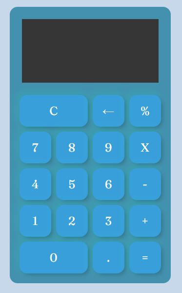

# Práctica JS

Que onda explorers!

En esta semana vimos como usar JavaScript para hacer que nuestras aplicaciones web tomen vida.
ustedes seguirán con ese proyecto para tener cada quien el suyo con las siguientes características.

- Maquetación del sitio con HTML
- Diseño con CSS para que parezca un pokedex la página.
- Tener un input de entrada, donde se meta el nombre del pokemón a buscar.
- Tomar ese input e ir a consultar el API de [pokeapi](https://pokeapi.co/)
- mostrar en pantalla los siguientes datos del pokemón ingresado:
    - Nombre
    - Imágen
    - Tipo de pokemón
    - Estadísticas
    - Movimientos

-Una imágen de un pokedex, pero pueden volar su creatividad a como gusten.

Uno de los primeros ejercicios de todo curso de programación es hacer una calculadora ya que te permite aprender. 
Para esta tarea debes hacer una calculadora con las siguientes operaciones:

- Suma 
- Resta 
- Multiplicación 
- División 
- Raiz cuiadrada 
- Potencia al número qe el usuario te diga 
- Residuo de una división 

-Una imágen de la calculadora terminada.

Bonus:
- Bonus si tu página es responsive y se puede ver en celulares
- Bonus de despliegue de tu pokedex
- Bonus de uso de otras rutas como búsqueda por número de pokemón o mostrar un rango de pokemóns

Pueden usar los conocimientos vistos o usar diferentes herramientas que conozcan o que investiguen como las librerías de diseño o librerías de JS sin problemas.

***VER LANDING PAGES***
Pokedex
<a href="https://pokee.azurewebsites.net/" target="_blank">AQUI</a>

Calculadora
<a href="https://pokee.azurewebsites.net/" target="_blank">AQUI</a>

***¡Vámonos hasta el espacio y más allá Explorers!***
<a href="https://github.com/ciloachamin/Launch-X-Latam" target="_self">Regresar a pagina anterior</a>